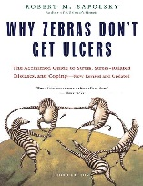

No Nerdologia de hoje, vamos descobrir como funcionam maldições

Livros
=====

**Título**: [Why Zebras Don't Get Ulcersl](http://www.amazon.com/Why-Zebras-Dont-Ulcers-Third/dp/0805073698) 
**Autor**: [Robert M. Sapolsky](https://med.stanford.edu/profiles/robert-sapolsky)

Artigos
=====

- Cannon, Walter B. ["“Voodoo” death."](http://www.ncbi.nlm.nih.gov/pubmed/12356599) American Anthropologist 44, no. 2 (1942): 169-181.
Harvard

- Häuser, Winfried, Ernil Hansen, and Paul Enck. ["Nocebo phenomena in medicine."](http://www.ncbi.nlm.nih.gov/pmc/articles/PMC3401955/) Dtsch Arztebl Int 109, no. 26 (2012): 459-465.

- Jensen, Karin B., Ted J. Kaptchuk, Irving Kirsch, Jacqueline Raicek, Kara M. Lindstrom, Chantal Berna, Randy L. Gollub, Martin Ingvar, and Jian Kong. ["Nonconscious activation of placebo and nocebo pain responses."](http://www.pnas.org/content/109/39/15959.short) Proceedings of the National Academy of Sciences 109, no. 39 (2012): 15959-15964.

- Lang, Elvira V., Eric G. Benotsch, Lauri J. Fick, Susan Lutgendorf, Michael L. Berbaum, Kevin S. Berbaum, Henrietta Logan, and David Spiegel. ["Adjunctive non-pharmacological analgesia for invasive medical procedures: a randomised trial."](http://www.ncbi.nlm.nih.gov/pubmed/10801169) The Lancet 355, no. 9214 (2000): 1486-1490.

- Reeves, Roy R., Mark E. Ladner, Roy H. Hart, and Randy S. Burke. ["Nocebo effects with antidepressant clinical drug trial placebos."](http://www.ncbi.nlm.nih.gov/pubmed/17484949) General hospital psychiatry 29, no. 3 (2007): 275-277.

Vídeo
=====

<iframe width="560" height="315" src="https://www.youtube.com/embed/KP8irk-6jrE" frameborder="0" allowfullscreen></iframe>
