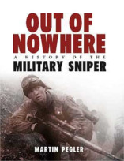

No Nerdologia História de hoje, vamos ver alguns dos principais atiradores de elite da História.

Livros
=====

**Título**: [The Military Sniper since 1914](https://ospreypublishing.com/the-military-sniper-since-1914-pb) 
**Autor**: [Martin Pegler](http://consultancy.martinpegler.com/)

**Título**: [Out of Nowhere](https://ospreypublishing.com/out-of-nowhere-hb) 
**Autor**: [Martin Pegler](http://consultancy.martinpegler.com/)

Vídeo
=====

<iframe width="560" height="315" src="https://www.youtube.com/embed/bIEYjwH_53c" frameborder="0" allowfullscreen></iframe>

