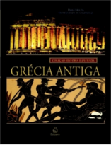

No Nerdologia História de hoje, vamos ver um pouco do porque Leônidas lutou com apenas trezentos espartanos ao seu lado.

Livros
=====

**Título**: [Os 300 de Esparta](https://www.amazon.com.br/Os-300-Esparta-Frank-Miller/dp/8575325825) 
**Autores**: [Frank Miller](https://en.wikipedia.org/wiki/Frank_Miller)

**Título**: [Grécia Antiga - História Ilustrada](http://www.ediouro.com.br/novo/livro/colecao-historia-ilustrada-grecia-antiga) 
**Organizador**: [Paul Cartledge](https://en.wikipedia.org/wiki/Paul_Cartledge)

Vídeo
=====

<iframe width="560" height="315" src="https://www.youtube.com/embed/BiD5Hqs9Q5w" frameborder="0" allowfullscreen></iframe>
