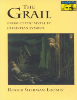

No Nerdologia História de hoje, vamos bater as metades de um coco e vamos cavalgar em uma busca!

Livros
=====

**Título**: [The Grail: From Celtic Myth to Christian Symbol](https://www.amazon.com/Grail-Celtic-Myth-Christian-Symbol/dp/0691020752) 
**Autores**: [Roger Sherman Loomis](https://en.wikipedia.org/wiki/Roger_Sherman_Loomis)

**Título**: [A Demanda do Santo Graal](https://www.hedra.com.br/livros/a-demanda-do-santo-graal) 
**Tradução**: [Marcus Baccega](http://buscatextual.cnpq.br/buscatextual/visualizacv.do?metodo=apresentar&id=K4764179P3)

Vídeo
=====

<iframe width="560" height="315" src="https://www.youtube.com/embed/BCy7TZi1l7E" frameborder="0" allowfullscreen></iframe>
