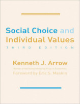
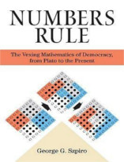

Bem vindos a mais um Nerdologia! Na aula de hoje vamos aprender como um sabre de luz poderia ser feito com a tecnologia que temos hoje e como ele se comportaria!

Artigos
=====

- Balinski, Michel, and Rida Laraki. "[Election by majority judgment: experimental evidence](http://link.springer.com/chapter/10.1007%2F978-1-4419-7539-3_2#page-1)." In In Situ and Laboratory Experiments on Electoral Law Reform, pp. 13-54. Springer New York, 2011.

- Reny, Philip J. "[Arrow’s theorem and the Gibbard-Satterthwaite theorem: a unified approach](http://www.sciencedirect.com/science/article/pii/S0165176500003323)." -Economics Letters 70, no. 1 (2001): 99-105. 

- Ball, Philip. "[Burning water and other myths](http://www.nature.com/news/2007/070914/full/news070910-13.html)." Nature News. doi 10 (2007): 070910-13.

Livros
=====

**Título**: [Social Choice and Individual Values](https://www.amazon.com/Social-Choice-Individual-Values-Foundation/dp/0300179316) 
**Autor**: [Kenneth Arrow](https://en.wikipedia.org/wiki/Kenneth_Arrow)

**Título**: [Numbers Rule: The Vexing Mathematics of Democracy, from Plato to the Present](https://www.amazon.com/Numbers-Rule-Mathematics-Democracy-Present/dp/0691139946) 
**Autor**: [George Szpiro](https://de.wikipedia.org/wiki/George_Szpiro)

Vídeo
=====

<iframe width="560" height="315" src="https://www.youtube.com/embed/JLr2kX_ldzE" frameborder="0" allowfullscreen></iframe>

