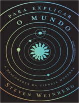
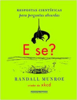

No Nerdologia de hoje, vamos ver qual o formato real da Terra, com e sem água.

Livros
=====

**Título**: [Para Explicar o Mundo](http://www.livrariacultura.com.br/p/para-explicar-o-mundo-93647377#) 
**Autor**: [Steven Weinberg](https://web2.ph.utexas.edu/~weintech/weinberg.html)

**Título**: [E Se? - Respostas científicas para perguntas absurdas](https://www.amazon.com.br/Se-Respostas-cient%C3%ADficas-perguntas-absurdas/dp/8535924833) 
**Autor**: [Randall Munroe](https://en.wikipedia.org/wiki/Randall_Munroe)

Artigos
=====

- Wilde, S. A.; Valley, J. W.; Peck, W. H.; Graham C. M. (2001). ["Evidence from detrital zircons for the existence of continental crust and oceans on the Earth 4.4 Gyr ago"](http://www.nature.com/nature/journal/v409/n6817/abs/409175a0.html). Nature 409 (6817): 175–178. doi:10.1038/35051550. PMID 11196637.

Vídeo
=====

<iframe width="560" height="315" src="https://www.youtube.com/embed/aW-qbx04gS4" frameborder="0" allowfullscreen></iframe>

