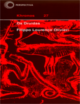

No Nerdologia História de hoje, Hoje vamos ver um pouco sobre os druidas e seus caldeirões de poção mágica.

Livros
=====

**Título**: [Os Druidas](http://www.editoraperspectiva.com.br/index.php?apg=cat&npr=1049) 
**Autor**: [Filippo Lourenço Olivieri](http://www.escavador.com/sobre/3726229/filippo-lourenco-olivieri)

=====

<iframe width="560" height="315" src="https://www.youtube.com/embed/Acbg9XP-dRw" frameborder="0" allowfullscreen></iframe>

