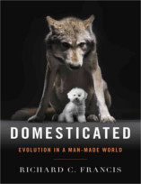

No Nerdologia de hoje, vamos ver se a mistura de humanos com outros animais seria possível.

Livros
=====

**Título**: [Domesticated: Evolution in a Man-Made World](https://www.amazon.com/Domesticated-Evolution-Man-Made-Richard-Francis/dp/0393064603) 
**Autor**: [Richard C. Francis](http://www.richardcfrancis.com/)

Artigos
=====

- Bedford, J. M. ["Sperm/egg interaction: the specificity of human spermatozoa."](http://www.ncbi.nlm.nih.gov/pubmed/409311)The Anatomical Record 188, no. 4 (1977): 477-487.

- O'Bleness, Majesta, Veronica B. Searles, Ajit Varki, Pascal Gagneux, and James M. Sikela. ["Evolution of genetic and genomic features unique to the human lineage."](http://www.ncbi.nlm.nih.gov/pubmed/23154808) Nature Reviews Genetics 13, no. 12 (2012): 853-866.

- Rossiianov, Kirill. ["Beyond species: Il’ya Ivanov and his experiments on cross-breeding humans with anthropoid apes."](http://www.ncbi.nlm.nih.gov/pubmed/12467272) Science in Context 15, no. 02 (2002): 277-316.

- Sankararaman, Sriram, Swapan Mallick, Michael Dannemann, Kay Prüfer, Janet Kelso, Svante Pääbo, Nick Patterson, and David Reich. ["The genomic landscape of Neanderthal ancestry in present-day humans."](http://www.nature.com/nature/journal/v507/n7492/full/nature12961.html) Nature 507, no. 7492 (2014): 354-357.

- zVernot, Benjamin, and Joshua M. Akey. ["Resurrecting surviving Neandertal lineages from modern human genomes."](http://science.sciencemag.org/content/343/6174/1017) Science 343, no. 6174 (2014): 1017-1021.

=====

<iframe width="560" height="315" src="https://www.youtube.com/embed/5Kpe4Al_JIs" frameborder="0" allowfullscreen></iframe>

