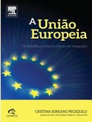

No Nerdologia História de hoje, vamos entender do que se trata esse termo que você tanto viu por aí, o Brexit.

Livros
=====

**Título**: [A Uniao Europeia](http://www.loja.elsevier.com.br/site/produtos/Detalhe-Produto.aspx?tid=94338&seg=22&cat=830&tit=A%20Uniao%20Europeia%20-%201%20EDI%C3%87%C3%83O) 
**Autor**: [Cristina Soreanu Pecequilo](http://www.loja.elsevier.com.br/site/institucional/Minha-pagina-autor.aspx?seg=22&aid=93869)

=====

<iframe width="560" height="315" src="https://www.youtube.com/embed/lMOm-MjO0uM" frameborder="0" allowfullscreen></iframe>
