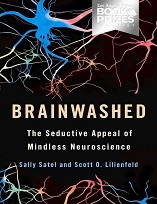

No Nerdologia de hoje, vamos ver se as mensagens subliminares funcionam.

Livros
=====

**Título**: [O Gorila Invisível - e Outros Equívocos da Intuição](http://www.saraiva.com.br/rapido-e-devagar-duas-formas-de-pensar-4074748.html) 
**Autor**: [Daniel Simons](www.dansimons.com/) e [Christopher Chabris](www.chabris.com/)

**Título**: [Brainwashed - The Seductive Appeal of Mindless Neuroscience](https://www.amazon.com/Brainwashed-Seductive-Appeal-Mindless-Neuroscience/dp/0465062911) 
**Autor**: [Sally Satel](https://www.sallysatelmd.com/) e [Scott O. Lilienfeld](https://psychology.emory.edu/home/people/faculty/lilienfeld-scott.html)

Artigos
=====

- Hannula, Deborah E., Daniel J. Simons, and Neal J. Cohen. ["Imaging implicit perception: promise and pitfalls."](http://www.nature.com/nrn/journal/v6/n3/full/nrn1630.html) Nature Reviews Neuroscience 6, no. 3 (2005): 247-255.

Vídeo
=====

<iframe width="560" height="315" src="https://www.youtube.com/embed/u0E-olnlJkE" frameborder="0" allowfullscreen></iframe>
